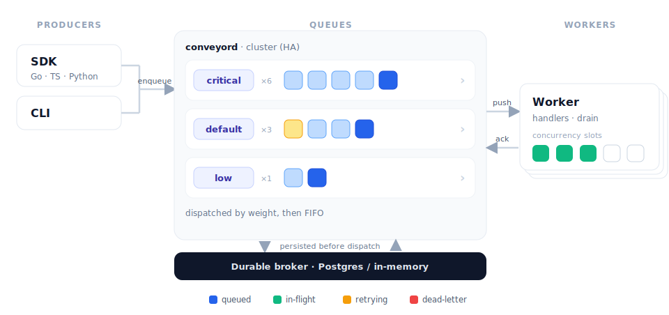

<div align="center">

# Conveyor

[](https://github.com/conveyorq/conveyor/actions/workflows/ci.yml)
[](https://codecov.io/gh/conveyorq/conveyor)
[](https://pkg.go.dev/github.com/conveyorq/conveyor)
[](LICENSE)

**A distributed, push-based task queue for Go.**

Persistent tasks with at-least-once execution, retries with backoff, scheduling,
and priorities, backed by Postgres or an in-memory broker, with **no Redis and no polling**.

</div>

<p align="center">
  <a href="docs/architecture.svg">
    
  </a>
</p>

## Contents

- [Features](#features)
- [How it compares](#how-it-compares)
- [Examples](#examples)
- [How it works](#how-it-works)
- [Writing a worker](#writing-a-worker)
- [Enqueueing work](#enqueueing-work)
- [SDKs](#sdks)
- [Embedded mode](#embedded-mode)
- [Dashboard](#dashboard)
- [Documentation](#documentation)
- [Contributing](#contributing)
- [License](#license)

## Features

- **Push-based dispatch**: the server streams work to connected workers the
  instant it exists, with credit-based flow control. No polling.
- **At-least-once with crash safety**: tasks are persisted before dispatch and
  survive server and worker crashes; a dead worker's task is redelivered.
- **Deploys are free**: a worker shutting down hands its in-flight tasks back
  with no retry penalty and no backoff; they resume immediately elsewhere, so
  rolling out a new build never burns a task's retry budget.
- **Retries** with exponential backoff, **delayed** and **scheduled** tasks,
  per-task **timeouts/deadlines**, and per-task **priorities**.
- **Weighted queues**: a worker declares a relative weight per queue, and the
  server hands a queue's tasks to the workers serving it in proportion to those
  weights, so a higher-weighted worker draws proportionally more of the work.
- **Unique tasks**, **dead-letter/archive**, **retention**, per-queue
  **pause/resume**, and a per-task-type **circuit breaker**.
- **Expiring tasks**: a pre-dispatch TTL (`ExpiresIn`/`ExpiresAt`): a task not
  dispatched in time is archived instead of run, for work that goes stale.
- **Task dependencies (workflows)**: order work with chains ("run B after A")
  and fan-out/fan-in, with a per-dependency policy for when a dependency fails.
- **Group aggregation**: coalesce many tasks into one batch and process them in
  a single handler call (debounce/digest, or bulk processing); fires on size,
  delay, or grace period.
- **Rate limiting**: cap a queue's dispatch rate (token bucket: rate + burst) to
  protect a downstream; a global default plus per-queue overrides, tunable live
  from the CLI, dashboard, or API.
- **Per-key concurrency limits**: cap how many tasks run at once per key (e.g.
  ≤ 5 in flight per `customer_id`, or one active per resource), set per queue and
  tunable live.
- **SDK middleware** wraps both sides: decorate enqueues
  (`WithEnqueueMiddleware`) and handlers (`Mux.Use`, `Mux.UseBatch`) for
  logging, metrics, or policy, without touching task code.
- **End-to-end encryption**: seal task payloads in the SDK/CLI
  (`WithEncryption`) so the server stores ciphertext only and holds no keys;
  built-in AES-256-GCM or bring your own KMS/HSM codec.
- **Cron**: server-persisted schedules that survive restarts and failover,
  pausable at runtime.
- **Built-in clustering / HA**: multi-node by default; a lost node's work
  re-activates elsewhere with zero task loss. Kubernetes discovery works out of
  the box, with a pluggable provider (static, DNS, NATS, Consul, etcd) for
  everywhere else.
- **Four ways to run it**: standalone, cluster, Kubernetes, or
  [embedded](#embedded-mode) in a Go process.
- **Secure by default**, with bearer-token auth that fails closed: outside `--dev`
  the server refuses to start unauthenticated unless you opt in explicitly.
- **Built-in operations dashboard**: an embedded web console to inspect and
  operate queues, tasks, cron, and connected workers; host it anywhere.
- **Prometheus metrics** and **OpenTelemetry traces** out of the box.
- **Lifecycle events**: subscribe to a live push stream of task state transitions
  (enqueued, leased, completed, retried, archived, …) over the API or the
  `conveyor events` CLI, or have the server POST them to a **webhook** for
  dashboards, alerting, audit logs, and event-driven chaining, without polling.

## How it compares

Conveyor is one of Go's durable task queues. Its closest peers are
[asynq](https://github.com/hibiken/asynq) (Redis-backed) and
[River](https://github.com/riverqueue/river) (Postgres-backed). Conveyor is
Postgres-first like River, but ships as a clustered **server** with a
language-neutral wire protocol and **push-based** dispatch, and it also runs
embedded inside a Go process.

| Capability                    |                                                                            Conveyor                                                                            |            asynq             |                 River                  |
|-------------------------------|:--------------------------------------------------------------------------------------------------------------------------------------------------------------:|:----------------------------:|:--------------------------------------:|
| Primary store                 |                                                                     Postgres or in-memory                                                                      |            Redis             |                Postgres                |
| Runs as                       |                                                                  Server and embedded library                                                                   |           Library            |                Library                 |
| Dispatch                      |                                                                        Push (streaming)                                                                        |             Poll             |      Poll plus `LISTEN`/`NOTIFY`       |
| HA / failover                 | Built-in clustering; a lost node's work re-activates elsewhere. Kubernetes discovery out of the box, or a pluggable provider (static, DNS, NATS, Consul, etcd) | Via Redis (Sentinel/Cluster) | Postgres advisory-lock leader election |
| Transactional enqueue         |                                                                               ✗                                                                                |              ✗               |                  ✓ ¹                   |
| SDK languages                 |                                                                     Go, TypeScript, Python                                                                     |              Go              |                   Go                   |
| Weighted queues               |                                                                               ✓                                                                                |              ✓               |                   ✗                    |
| Per-task priority             |                                                                           ✓ (1 to 9)                                                                           |      ✗ (queue weights)       |                   ✓                    |
| Delayed / scheduled           |                                                                               ✓                                                                                |              ✓               |                   ✓                    |
| Cron / periodic               |                                                            ✓ (server-persisted, survives failover)                                                             |         ✓ (in code)          |              ✓ (in code)               |
| Unique tasks                  |                                                                               ✓                                                                                |              ✓               |                   ✓                    |
| Retries with backoff          |                                                                               ✓                                                                                |              ✓               |                   ✓                    |
| Dead-letter / archive         |                                                                               ✓                                                                                |              ✓               |                   ✓                    |
| Pause / resume queues         |                                                                               ✓                                                                                |              ✓               |                   ✓                    |
| Rate limiting                 |                                                                      ✓ (per-queue, live)                                                                       |            DIY ²             |                   ✗                    |
| Per-key concurrency           |                                                                               ✓                                                                                |              ✗               |                   ✗                    |
| Circuit breaker               |                                                                       ✓ (per task type)                                                                        |              ✗               |                   ✗                    |
| Task dependencies (workflows) |                                                                     ✓ (chains, fan-out/in)                                                                     |              ✗               |                 Pro ³                  |
| Group aggregation / batching  |                                                                               ✓                                                                                |              ✓               |                   ✗                    |
| End-to-end payload encryption |                                                                               ✓                                                                                |              ✗               |                   ✗                    |
| Lifecycle events / webhooks   |                                                                               ✓                                                                                |              ✗               |                   ✗                    |
| Web operations UI             |                                                                    Embedded, read and write                                                                    |           asynqmon           |                riverui                 |

¹ River commits the job inside *your* database transaction (`InsertTx`), so the
job and your data commit atomically. Conveyor's broker is owned by the server,
so an enqueue is durable but not part of your application transaction. If you
need that atomicity, use the
[outbox pattern](https://microservices.io/patterns/data/transactional-outbox.html)
or stay on River. It is the main reason to pick River; see
[migrating from River](docs/migrate-from-river.md).
² asynq rate limiting is the `RateLimitError` pattern (you supply the limiter),
not a built-in server-side limiter.
³ Workflow DAGs are a commercial River Pro feature, not part of the OSS core.

The table reflects each project's open-source core at the time of writing; all
three are actively developed, so check upstream for changes (corrections welcome
via a PR). For durable, long-running *business* workflows (sagas, multi-day
orchestrations), a workflow engine such as Temporal or Cadence is a different and
complementary category: Conveyor is a task queue, not a workflow engine.

## Examples

Runnable examples live in [`examples/`](examples). Start with Postmark for the
full picture, or Standalone for the smallest local loop.

### Postmark: the full system on Kubernetes

[`examples/postmark`](examples/postmark) is the flagship: a transactional email
and notification platform on a Postgres-backed, three-node cluster. One command
builds the images, stands up the cluster, deploys the workers and producer,
configures the queues and cron, and opens the dashboard:

```sh
make postmark-demo
```

It runs nearly every feature under continuous load: weighted queues, per-task
priority, retries with backoff, dead-lettering, the circuit breaker, cron,
per-key concurrency, and crash-safe failover. Drive it with make targets while
it runs:

```sh
make postmark-stats        # per-queue depth and pause flags
make postmark-pause        # stop marketing sends; transactional keeps flowing
make postmark-kill-node    # delete a node and watch zero task loss
make postmark-archived     # the dead-letter queue (hard-bounce mail)
make postmark-clean        # tear it all down
```

It needs docker, kind, kubectl, and helm. The
[Postmark README](examples/postmark) has the guided tour.

### Standalone: the smallest local loop

[`examples/standalone`](examples/standalone) is one `conveyord`, one worker, and
one client, in three terminals:

```sh
go run ./cmd/conveyord --dev          # 1: server (in-memory broker, auth off)
go run ./examples/standalone/worker   # 2: worker
go run ./examples/standalone/client   # 3: enqueue ten welcome emails
```

### More

- **[Embedded](examples/embedded)** runs the whole system in a single Go process
  with no infrastructure (see [Embedded mode](#embedded-mode)).
- **[TypeScript](examples/typescript)** and **[Python](examples/python)** are the
  same worker-and-producer shape on the other two SDKs.

## How it works

Conveyor has three moving parts: your **client** enqueues tasks, the
**server** (`conveyord`) owns them, and your **workers** process them. A
durable **broker** (Postgres in production, in-memory for dev) is the source
of truth. Tasks are persisted *before* they're dispatched, so they survive any
crash. The [architecture diagram](#conveyor) at the top of this README shows
the whole flow.

**Push, not poll.** The server pushes tasks to workers the instant work
exists and a worker has free capacity, so there's no poll interval to tune and
no Redis. Each worker opens one persistent connection, tells the server which
queues it serves and how much it can handle, and receives work over that
stream. When a worker is saturated it simply stops accepting more, and the
extra work waits safely in the broker.

**At-least-once execution.** A task is delivered until a worker acknowledges
it. If a worker dies mid-task, the task is redelivered, so **handlers must be
idempotent**. Return `conveyor.SkipRetry(err)` to dead-letter immediately;
panics are recovered and treated as retryable failures.

**What the server gives you:** named queues with weights, bounded worker
concurrency, retries with exponential backoff, per-task priorities, delayed
and scheduled tasks, cron, unique tasks, retention/archival, and a read-only
admin/inspection API, all enforced server-side. Your code only writes
handlers and enqueues tasks.

The server coordinates all of this across a cluster of `conveyord` nodes:
queues, scheduling, and lease recovery rebalance automatically when a node is
lost, and no task is dropped. Scale by adding nodes; the broker is the only
stateful dependency.

## Writing a worker

A worker registers a handler per task type, then runs. The shape is the same in every SDK.

### Go

```go
w, _ := conveyor.NewWorker("http://localhost:8080",
    conveyor.WithQueues(map[string]int{"critical": 6, "default": 3}),
    conveyor.WithConcurrency(20),
)

mux := conveyor.NewMux()
mux.HandleFunc("email:welcome", func(ctx context.Context, t *conveyor.Task) error {
    var p WelcomeEmail
    if err := t.Bind(&p); err != nil {
        return conveyor.SkipRetry(err) // a payload that cannot decode never will
    }

    return sendEmail(ctx, p)
})

_ = w.Run(ctx, mux) // blocks; reconnects with jitter; drains on ctx cancel
```

### TypeScript

The shape of [`examples/typescript`](examples/typescript/src/worker.ts):

```ts
import { Mux, skipRetry, type Task, Worker } from "@conveyorq/conveyor";

const mux = new Mux().handle("email:welcome", async (task: Task, { signal }) => {
  const email = task.json<{ to: string; name: string }>();
  if (!email.to) throw skipRetry("missing recipient");          // permanent → dead-letter
  await sendEmail(email.to, `Welcome, ${email.name}!`, signal); // any other throw → retried
});

const stop = new AbortController();
for (const sig of ["SIGTERM", "SIGINT"] as const) process.on(sig, () => stop.abort());

const worker = new Worker("http://localhost:8080", {
  queues: { email: 1 },
  concurrency: 8,
  token: process.env.CONVEYOR_TOKEN,
});

await worker.run(mux, stop.signal); // blocks; reconnects with jitter; drains on abort
```

### Python

The shape of [`examples/python`](examples/python/worker.py); a synchronous `SyncWorker` exists too:

```python
import asyncio
import os

from conveyorq import Mux, SkipRetry, Worker


async def main() -> None:
    mux = Mux()

    @mux.handler("email:welcome")
    async def send_welcome(task, ctx) -> None:
        email = task.json()
        if not email.get("to"):
            raise SkipRetry("missing recipient")             # permanent → dead-letter
        await send_email(email["to"], f"Welcome, {email['name']}!")  # else retried


    worker = Worker(
        "http://localhost:8080",
        queues={"email": 1},
        concurrency=8,
        token=os.environ.get("CONVEYOR_TOKEN") or None,
    )
    await worker.run(mux)  # drains gracefully on SIGTERM/SIGINT


asyncio.run(main())
```

Handlers must be idempotent and should honor cancellation (`ctx.Done()` in Go,
the abort signal in TypeScript and Python). A handler that panics or throws is
recovered and reported as a retryable failure, and it never kills the worker.

## Enqueueing work

### Go

```go
client, _ := conveyor.NewClient("http://localhost:8080")

info, _ := client.Enqueue(ctx,
    conveyor.NewTask("email:welcome", conveyor.JSON(WelcomeEmail{UserID: 42})),
    conveyor.Queue("critical"),
    conveyor.ProcessIn(5*time.Minute),
    conveyor.MaxRetry(10),
)
```

### TypeScript

The shape of [`examples/typescript`](examples/typescript/src/producer.ts), where durations are milliseconds:

```ts
import { Client, json, newTask } from "@conveyorq/conveyor";

const client = new Client("http://localhost:8080", { token: process.env.CONVEYOR_TOKEN });

const info = await client.enqueue(newTask("email:welcome", json({ to: "ada@example.com", name: "Ada" })), {
  queue: "email",
  processIn: 5 * 60_000, // milliseconds
  maxRetry: 10,
});
```

### Python

The shape of [`examples/python`](examples/python/client.py), where durations are `timedelta`:

```python
import asyncio
from datetime import timedelta

from conveyorq import Client, json, new_task


async def main() -> None:
    async with Client("http://localhost:8080") as client:
        info = await client.enqueue(
            new_task("email:welcome", json({"to": "ada@example.com", "name": "Ada"})),
            queue="email",
            process_in=timedelta(minutes=5),
            max_retry=10,
        )
        print(info.id, info.state.value)


asyncio.run(main())
```

### Command line

```sh
go run ./cmd/conveyor enqueue email:welcome --queue critical --json '{"user_id":42}' --in 5m
```

## SDKs

One wire protocol, three SDKs: a task enqueued from any of them runs on a
worker written in any other.

- **Go**: [`sdks/go`](sdks/go/README.md), `import conveyor "github.com/conveyorq/conveyor/sdks/go"`.
  The reference implementation (the worker and enqueue examples above).
- **TypeScript**: [`sdks/typescript`](sdks/typescript/README.md), Node 20+.
- **Python**: [`sdks/python`](sdks/python/README.md), Python 3.9+, with both
  async and synchronous APIs.

The TypeScript and Python SDKs match the Go SDK feature-for-feature: a producer
client, a worker runtime (push-based dispatch, heartbeats, graceful drain),
JSON/binary codecs, and AES-256-GCM end-to-end encryption that is byte-compatible
across all three. The SDKs are not yet published to npm or PyPI, so install from
the in-repo source; each SDK's README has the exact commands. The wire contract
that any new SDK implements is specified in [`docs/protocol.md`](docs/protocol.md).

The SDK surface is deliberately limited to **producing and consuming** work.
Operational actions on tasks and queues (reschedule, run-now, cancel, delete,
archive, pause and resume, rate and concurrency limits, cron) are driven by the
`conveyor` CLI and the [dashboard](#dashboard), which keeps the application
surface small and operator concerns out of app code.

## Embedded mode

Run the whole system (broker, server, and dispatch) inside your own Go
process, with no separate `conveyord` to deploy and no network hop. Your handler
and enqueue code is identical to a remote deployment.

```go
system, _ := embedded.Start(ctx, embedded.Config{Broker: embedded.Memory()})
defer system.Stop(ctx)

client := system.Client()
worker := system.Worker(conveyor.WithQueues(map[string]int{"default": 1}), conveyor.WithConcurrency(8))
```

**Use it for:**

- **Tests**: a full-fidelity node in a plain `go test`, with no Docker or
  external infrastructure.
- **Single-process apps**: a CLI, an edge/desktop binary, or a small service
  that wants durable background jobs without operating a separate server.
- **Local development and demos**: producer, worker, and server in one process
  (see [`examples/embedded`](examples/embedded)).
- **A zero-friction start**: adopt Conveyor now; graduating to a cluster later
  is just swapping `embedded.Start` for `conveyor.NewClient`/`NewWorker` with a
  URL, leaving handler and enqueue code unchanged.

**Durability vs. availability: read this before production.** Embedded is a
single process, which has two distinct consequences people often conflate:

- **Durability is your choice of broker.** `embedded.Memory()` keeps nothing
  across a restart, which is right for tests and disposable work. `embedded.Postgres(dsn)`
  gives the same durability as a remote deployment: queued and in-flight work
  survives a restart.
- **It is not highly available.** One process is a single point of failure;
  while it is down, nothing is dispatched. Embedded always runs as a cluster of
  one on a private loopback port and cannot join or form a multi-node cluster.

So embedded can be **durable** (with Postgres) but never **HA**. For high
availability (no single point of failure, automatic failover) run the real
deployment: multiple `conveyord` nodes clustered over a shared Postgres broker,
where a lost node's work re-activates elsewhere with no task loss. See the
[operations guide](docs/operations.md).

## Dashboard

`conveyord` embeds a web operations console, served at the API root and **enabled
by default in every mode, production included.** Open the server's API URL in a
browser. In production it sits behind the same bearer-token auth as the API: you
enter a token in the UI, which is kept client-side and sent on each call.
`conveyord --dev` is just the local convenience: auth off, zero config.

It is a full read **and write** console: inspect queues, drill into tasks by
state with a detail view, manage cron, and see the worker sessions connected to
each node, and act: run, reschedule, cancel, and delete tasks, pause/resume queues, edit cron.
Auto-refresh keeps it live, and a configurable link deep-links to Grafana for
time-series metrics.

The UI is just an API client, so you can run the embedded copy, serve the same
bundle from your own host/CDN, or front both behind one ingress. Set
`api.dashboard: false` to disable the embedded copy, `api.cors_origins` to allow
a different-origin UI, and `api.grafana_url` for the metrics link. See the
[operations guide](docs/operations.md#dashboard).

## Documentation

- [Concepts](docs/concepts.md): the core vocabulary in plain terms: task,
  queue, client, server, worker, and broker, and how they fit together. Start here.
- [Architecture](docs/architecture.md): how the system works inside: the actor
  runtime, queue grains, broker, dispatch, and clustering, for contributors.
- [Operations guide](docs/operations.md): deployment modes, configuration,
  scaling, broker sizing, security, observability, and upgrades.
- [High availability](docs/high-availability.md): a complete clustered deployment
  that ties the server, Postgres, and worker tiers together.
- [Task dependencies](docs/workflows.md): order work with chains and
  fan-out/fan-in, and choose what happens when a dependency fails.
- [Group aggregation](docs/grouping.md): how to enqueue grouped tasks, write
  batch handlers, and tune the firing policy.
- [Rate limiting](docs/rate-limiting.md): cap per-queue dispatch rate with a
  global default and live per-queue overrides.
- [Concurrency limits](docs/concurrency.md): cap how many tasks run at once per
  concurrency key, set per queue and tunable live.
- [End-to-end encryption](docs/encryption.md): seal task payloads in the
  SDK/CLI so the server stores ciphertext only and holds no keys.
- [Expiring tasks](docs/expiring-jobs.md): a pre-dispatch TTL, and how it
  differs from a deadline and from retention.
- [Lifecycle events](docs/events.md): the push event stream and webhook sink,
  covering event types, filtering, delivery semantics, and configuration.
- [Wire protocol](docs/protocol.md): the normative protocol spec for SDK
  authors building a Conveyor client or worker in another language.
- [Go SDK](sdks/go/README.md): the reference client and worker for Go services.
- [TypeScript SDK](sdks/typescript/README.md): enqueue and process tasks from
  Node.
- [Python SDK](sdks/python/README.md): async and sync clients and workers, with
  a "Conveyor for Celery/RQ users" intro.
- [Migrating from asynq](docs/migrate-from-asynq.md): side-by-side API mapping.
- [Migrating from River](docs/migrate-from-river.md): side-by-side API mapping,
  and the one trade-off to decide first (transactional enqueue).
- [Benchmark harness](benchmark/README.md): reproducible throughput/latency
  harness (`make benchmark`) and its honesty notes.
- Deployment artifacts live under [`deploy/`](deploy): Docker, Helm, systemd,
  Compose, and Grafana.
- [Contributing](CONTRIBUTING.md): build, test, conventions, and how to submit
  changes.
- [Changelog](CHANGELOG.md): release history.

## Contributing

Contributions are welcome. See [CONTRIBUTING.md](CONTRIBUTING.md) for
prerequisites, how to build, test, and submit changes, the `make` targets, the
end-to-end test workflow, and the project conventions. Two checks run on every
pull request worth knowing up front: commit messages must follow
[Conventional Commits](https://www.conventionalcommits.org), and every commit
must be signed off for the [DCO](https://developercertificate.org) (`git commit -s`).

## License

Conveyor is **fully open source** under the [Apache License 2.0](LICENSE): the
entire project, with no separate enterprise, commercial, or closed-source
edition. Third-party dependency licenses are inventoried in
[docs/licenses.md](docs/licenses.md).
