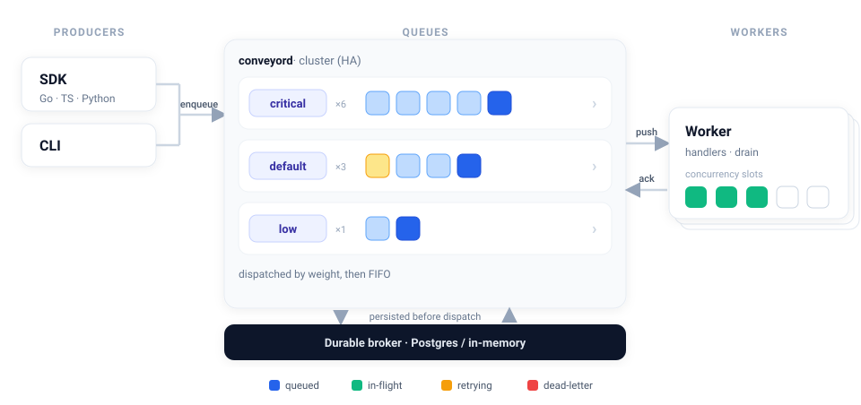
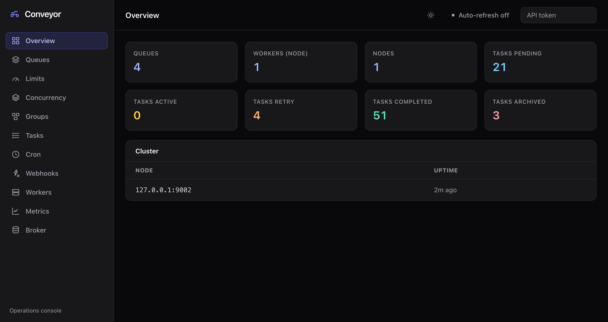

<div align="center">

# Conveyor

[](https://github.com/conveyorq/conveyor/actions/workflows/ci.yml)
[](https://codecov.io/gh/conveyorq/conveyor)
[](https://pkg.go.dev/github.com/conveyorq/conveyor)
[](LICENSE)

**A distributed, push-based task queue with Go, TypeScript, and Python SDKs.**

Persistent tasks with at-least-once execution, retries with backoff, scheduling,
and priorities, backed by Postgres or an in-memory broker, with **no Redis and no polling**.

</div>

<p align="center">
  <a href="docs/architecture.svg">
    
  </a>
</p>

## Contents

- [Features](#features)
- [Quick start](#quick-start)
- [How it works](#how-it-works)
- [Ways to use it](#ways-to-use-it)
- [Dashboard](#dashboard)
- [Examples](#examples)
- [How it compares](#how-it-compares)
- [Documentation](#documentation)
- [Contributing](#contributing)

## Features

- **Push-based dispatch**: the server streams work to connected workers the
  instant it exists, with credit-based flow control. No polling.
- **At-least-once with crash safety**: tasks are persisted before dispatch and
  survive server and worker crashes; a dead worker's task is redelivered.
- **Deploys are free**: a worker shutting down hands its in-flight tasks back
  with no retry penalty and no backoff; they resume immediately elsewhere, so
  rolling out a new build never burns a task's retry budget.
- **Retries** with configurable backoff (exponential, linear, or fixed; set
  server-wide or per task), **delayed** and **scheduled** tasks, per-task
  **timeouts/deadlines**, and per-task **priorities**.
- **Reschedule tasks**: move a waiting task's due time to a new instant in place,
  keeping its id and dependencies, from the CLI, dashboard, or API.
- **Weighted queues**: a worker declares a relative weight per queue, and the
  server hands a queue's tasks to the workers serving it in proportion to those
  weights, so a higher-weighted worker draws proportionally more of the work.
- **Atomic multi-task enqueue**: commit many tasks in one `EnqueueTx` call that
  is all-or-nothing (every task lands or none do), so a set of related tasks is
  never left with an orphaned or missing member. The same guarantee holds on any
  broker. Available in the Go, TypeScript, and Python SDKs.
- **Unique tasks**, **dead-letter/archive**, **retention**, per-queue
  **pause/resume**, and a per-task-type **circuit breaker**.
- **Expiring tasks**: a pre-dispatch TTL (`ExpiresIn`/`ExpiresAt`): a task not
  dispatched in time is archived instead of run, for work that goes stale.
- **Task dependencies (workflows)**: order work with chains ("run B after A")
  and fan-out/fan-in, with a per-dependency policy for when a dependency fails.
- **Group aggregation**: coalesce many tasks into one batch and process them in
  a single handler call (debounce/digest, or bulk processing); fires on size,
  delay, or grace period. A global default plus per-group overrides (size, delay,
  grace), tunable live from the CLI, dashboard, or API, let each group batch on
  its own terms.
- **Rate limiting**: cap a queue's dispatch rate (token bucket: rate + burst) to
  protect a downstream; a global default plus per-queue overrides, tunable live
  from the CLI, dashboard, or API.
- **Per-key concurrency limits**: cap how many tasks run at once per key (e.g.
  ≤ 5 in flight per `customer_id`, or one active per resource), set per queue and
  tunable live.
- **SDK middleware** wraps both sides: decorate enqueues
  (`WithEnqueueMiddleware`) and handlers (`Mux.Use`, `Mux.UseBatch`) for
  logging, metrics, or policy, without touching task code.
- **End-to-end encryption**: seal task payloads in the SDK/CLI
  (`WithEncryption`) so the server stores ciphertext only and holds no keys;
  built-in AES-256-GCM or bring your own KMS/HSM codec.
- **Cron**: server-persisted schedules that survive restarts and failover,
  pausable at runtime.
- **Built-in clustering / HA**: multi-node by default; a lost node's work
  re-activates elsewhere with zero task loss. Kubernetes and static discovery
  work out of the box, with a pluggable provider interface for everywhere else.
- **Four ways to run it**: standalone, cluster, Kubernetes, or
  [embedded](docs/embedded.md) in a Go process.
- **Secure by default**, with bearer-token auth that fails closed: outside `--dev`
  the server refuses to start unauthenticated unless you opt in explicitly.
- **Built-in operations dashboard**: an embedded web console to inspect and
  operate queues, tasks, cron, and connected workers; host it anywhere.
- **Task progress reporting**: a long-running handler reports how far it has
  advanced (a percent plus an optional status); the value surfaces on the task in
  the dashboard and API, so you can tell a slow task from a stuck one.
- **Prometheus metrics** and **OpenTelemetry traces** out of the box.
- **Lifecycle events**: subscribe to a live push stream of task state transitions
  (enqueued, leased, completed, retried, archived, …) over the API or the
  `conveyor events` CLI, or have the server POST them to a **webhook** for
  dashboards, alerting, audit logs, and event-driven chaining, without polling.

See [use cases](docs/use-cases.md) for the shapes of work these fit, from
transactional email to AI inference jobs, and the features each leans on.

## Quick start

The smallest loop is one `conveyord`, one worker, and one client, in three
terminals, from a checkout (Go 1.27+):

```sh
go run ./cmd/conveyord --dev          # 1: server (in-memory broker, auth off)
go run ./examples/standalone/worker   # 2: worker
go run ./examples/standalone/client   # 3: enqueue ten welcome emails
```

Open <http://localhost:8080/> to watch the tasks flow through the
[dashboard](#dashboard). The [installation guide](docs/install.md) has every
other way to run the server (container image, Compose, Helm, systemd) plus the
CLI and SDK installs.

A **worker** registers a handler per task type and a **client** enqueues tasks;
the shape is the same in every SDK. In Go it is as small as:

```go
// Worker: register a handler, then run.
mux := conveyor.NewMux()
mux.HandleFunc("email:welcome", func(ctx context.Context, t *conveyor.Task) error {
    var p WelcomeEmail
    if err := t.Bind(&p); err != nil {
        return conveyor.SkipRetry(err) // a payload that cannot decode never will
    }

    return sendEmail(ctx, p)
})
_ = w.Run(ctx, mux) // blocks; reconnects with jitter; drains on ctx cancel

// Client: enqueue a task.
info, _ := client.Enqueue(ctx,
    conveyor.NewTask("email:welcome", conveyor.JSON(WelcomeEmail{UserID: 42})),
    conveyor.Queue("critical"),
    conveyor.ProcessIn(5*time.Minute),
    conveyor.MaxRetry(10),
)
```

Handlers must be idempotent and should honor cancellation (`ctx.Done()` in Go,
the abort signal in TypeScript and Python). A handler that panics or throws is
recovered and reported as a retryable failure, and it never kills the worker.
The [usage guide](docs/usage.md) has the full worker and enqueue snippets for
Go, TypeScript, Python, and the CLI.

## How it works

Conveyor has three moving parts: your **client** enqueues tasks, the
**server** (`conveyord`) owns them, and your **workers** process them. A
durable **broker** (Postgres in production, in-memory for dev) is the source
of truth. Tasks are persisted *before* they're dispatched, so they survive any
crash. The [architecture diagram](#conveyor) at the top of this README shows
the whole flow.

**Push, not poll.** The server pushes tasks to workers the instant work
exists and a worker has free capacity, so there's no poll interval to tune and
no Redis. Each worker opens one persistent connection, tells the server which
queues it serves and how much it can handle, and receives work over that
stream. When a worker is saturated it simply stops accepting more, and the
extra work waits safely in the broker.

**At-least-once execution.** A task is delivered until a worker acknowledges
it. If a worker dies mid-task, the task is redelivered, so **handlers must be
idempotent**.

The server coordinates all of this across a cluster of `conveyord` nodes:
queues, scheduling, and lease recovery rebalance automatically when a node is
lost, and no task is dropped. Scale by adding nodes; the broker is the only
stateful dependency. [Concepts](docs/concepts.md) covers the vocabulary and the
execution guarantees; [architecture](docs/architecture.md) covers the internals.

## Ways to use it

One wire protocol, several ways to speak it: a task enqueued from any of them
runs on a worker written in any other.

- **SDKs.** [Go](sdks/go/README.md) is the reference implementation;
  [TypeScript](sdks/typescript/README.md) (Node 20+) and
  [Python](sdks/python/README.md) (3.9+, async and sync) match it
  feature-for-feature: a producer client, a worker runtime (push-based dispatch,
  heartbeats, graceful drain), JSON/binary codecs, and AES-256-GCM end-to-end
  encryption that is byte-compatible across all three. The SDKs are not yet
  published to npm or PyPI, so install from the in-repo source; each README has
  the exact commands.
- **Plain HTTP** to produce. The server speaks HTTP/JSON on the same port, so
  any language, cron job, or webhook can enqueue with a POST. See the
  [HTTP API](docs/http-api.md).
- **Webhook workers** to consume, still push-based. Register an HTTP endpoint
  and Conveyor delivers each task to it as a signed JSON-RPC call, with the same
  retries, concurrency, and circuit breaking an SDK worker gets. See
  [webhook workers](docs/webhook-workers.md).
- **Embedded** in your own Go process: broker, server, and dispatch in-process,
  with no separate `conveyord` to deploy, for tests, single-process apps, and a
  zero-friction start. Durable with Postgres, but never highly available. See
  [embedded mode](docs/embedded.md).
- **The `conveyor` CLI** produces, inspects, and operates. Rescheduling,
  running, canceling, deleting, and archiving tasks, pausing queues, setting
  limits, and managing cron and webhook workers are operator actions, driven by
  the CLI and the [dashboard](#dashboard) and deliberately kept out of the SDKs.
  See the [CLI reference](docs/cli.md).

A new SDK implements the wire contract in the [protocol spec](docs/protocol.md).

## Dashboard

`conveyord` embeds a web operations console, served at the API root and **enabled
by default in every mode, production included.** Open the server's API URL in a
browser; in production it sits behind the same bearer-token auth as the API.



It is a full read **and write** console: inspect queues, tasks, cron, limits,
webhook workers, and the worker sessions connected to each node, and act on
them. The [dashboard guide](docs/dashboard.md) covers every view, signing in,
read-only mode, and hosting the UI on another origin.

## Examples

Runnable examples live in [`examples/`](examples).

- **[Postmark](examples/postmark)** is the flagship: a transactional email and
  notification platform on a Postgres-backed, three-node Kubernetes cluster,
  running nearly every feature under continuous load. `make postmark-demo`
  builds the images, stands up the cluster, deploys the workers and producer,
  configures the queues and cron, and opens the dashboard (needs docker, kind,
  kubectl, and helm). The [Postmark README](examples/postmark) has the guided
  tour.
- **[Standalone](examples/standalone)** is the three-terminal loop from the
  [quick start](#quick-start).
- **[Embedded](examples/embedded)** runs the whole system in a single Go process
  with no infrastructure.
- **[TypeScript](examples/typescript)** and **[Python](examples/python)** are the
  same worker-and-producer shape on the other two SDKs.
- **[Webhook](examples/webhook)** processes pushed tasks over HTTP with no SDK
  at all.

## How it compares

**Conveyor** is a durable task queue. Its closest peers are
[asynq](https://github.com/hibiken/asynq) (Redis-backed) and
[River](https://github.com/riverqueue/river) (Postgres-backed), both Go
libraries. **Conveyor** is Postgres-first like River, but ships as a clustered
**server** with a language-neutral wire protocol and **push-based** dispatch,
serves Go, TypeScript, and Python SDKs, and also runs embedded inside a Go
process.

The main reason to pick River instead is transactional enqueue: River commits
the job inside *your* database transaction, while Conveyor's broker is owned by
the server, so an enqueue is durable but not part of your application
transaction. If you need that atomicity, use the
[outbox pattern](https://microservices.io/patterns/data/transactional-outbox.html)
or stay on River. The capability-by-capability table against both is on the
[comparison page](docs/comparison.md). For durable, long-running *business*
workflows (sagas, multi-day orchestrations), a workflow engine such as Temporal
or Cadence is a different and complementary category: Conveyor is a task queue,
not a workflow engine.

## Documentation

The guides are published as a searchable site at
<https://conveyorq.github.io/conveyor/>, built from [`docs/`](docs) with
VitePress (`make docs-dev` previews it locally).

**Guide**

- [Installation](docs/install.md): every way to run the server (source,
  container image, Compose, Helm), plus the CLI and the three SDK installs.
- [Concepts](docs/concepts.md): the core vocabulary in plain terms: task,
  queue, client, server, worker, and broker, and how they fit together. Start here.
- [Use cases](docs/use-cases.md): the shapes of work Conveyor suits, from
  transactional email to AI inference jobs, and the features each leans on.
- [Usage guide](docs/usage.md): the full worker and enqueue snippets for Go,
  TypeScript, Python, and the CLI.

**Interfaces**

- [CLI reference](docs/cli.md): every `conveyor` command, its flags, and the
  global address/token/encryption settings, for producing and operating.
- [Dashboard](docs/dashboard.md): the embedded operations console: inspect
  queues, tasks, cron, and workers, and act on them from a browser.
- [HTTP API](docs/http-api.md): enqueue and inspect tasks from any language
  over plain HTTP/JSON, no SDK required.
- [Webhook workers](docs/webhook-workers.md): process pushed tasks over a
  signed JSON-RPC endpoint, with no SDK, while staying push-based.
- [Embedded mode](docs/embedded.md): run broker, server, and dispatch inside
  your own Go process, and what that means for durability and availability.

**Features**

- [Task dependencies](docs/workflows.md): order work with chains and
  fan-out/fan-in, and choose what happens when a dependency fails.
- [Group aggregation](docs/grouping.md): how to enqueue grouped tasks, write
  batch handlers, and tune the firing policy.
- [Rate limiting](docs/rate-limiting.md): cap per-queue dispatch rate with a
  global default and live per-queue overrides.
- [Concurrency limits](docs/concurrency.md): cap how many tasks run at once per
  concurrency key, set per queue and tunable live.
- [End-to-end encryption](docs/encryption.md): seal task payloads in the
  SDK/CLI so the server stores ciphertext only and holds no keys.
- [Expiring tasks](docs/expiring-jobs.md): a pre-dispatch TTL, and how it
  differs from a deadline and from retention.
- [Lifecycle events](docs/events.md): the push event stream and webhook sink,
  covering event types, filtering, delivery semantics, and configuration.

**Operations**

- [Operations guide](docs/operations.md): deployment modes, configuration,
  scaling, broker sizing, security, observability, and upgrades.
- [High availability](docs/high-availability.md): a complete clustered deployment
  that ties the server, Postgres, and worker tiers together.
- [Architecture](docs/architecture.md): how the system works inside: the actor
  runtime, queue grains, broker, dispatch, and clustering, for contributors.
- Deployment artifacts live under [`deploy/`](deploy): Docker, Helm, systemd,
  Compose, and Grafana.

**SDKs**

- [Go SDK](sdks/go/README.md): the reference client and worker for Go services.
- [TypeScript SDK](sdks/typescript/README.md): enqueue and process tasks from
  Node.
- [Python SDK](sdks/python/README.md): async and sync clients and workers, with
  a "Conveyor for Celery/RQ users" intro.

**Migrate**

- [How it compares](docs/comparison.md): Conveyor next to asynq and River,
  capability by capability, and when a workflow engine is the better fit.
- [Migrating from asynq](docs/migrate-from-asynq.md): side-by-side API mapping.
- [Migrating from River](docs/migrate-from-river.md): side-by-side API mapping,
  and the one trade-off to decide first (transactional enqueue).

**Reference**

- [Wire protocol](docs/protocol.md): the normative protocol spec for SDK
  authors building a Conveyor client or worker in another language.
- [Benchmark harness](benchmark/README.md): reproducible throughput/latency
  harness (`make benchmark`) and its honesty notes.
- [Contributing](CONTRIBUTING.md): build, test, conventions, and how to submit
  changes.
- [Changelog](CHANGELOG.md): release history.

## Contributing

Contributions are welcome. See [CONTRIBUTING.md](CONTRIBUTING.md) for
prerequisites, how to build, test, and submit changes, the `make` targets, the
end-to-end test workflow, and the project conventions. Two checks run on every
pull request worth knowing up front: commit messages must follow
[Conventional Commits](https://www.conventionalcommits.org), and every commit
must be signed off for the [DCO](https://developercertificate.org) (`git commit -s`).
