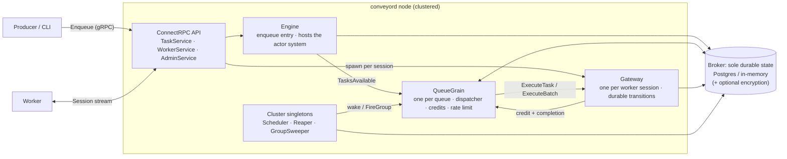
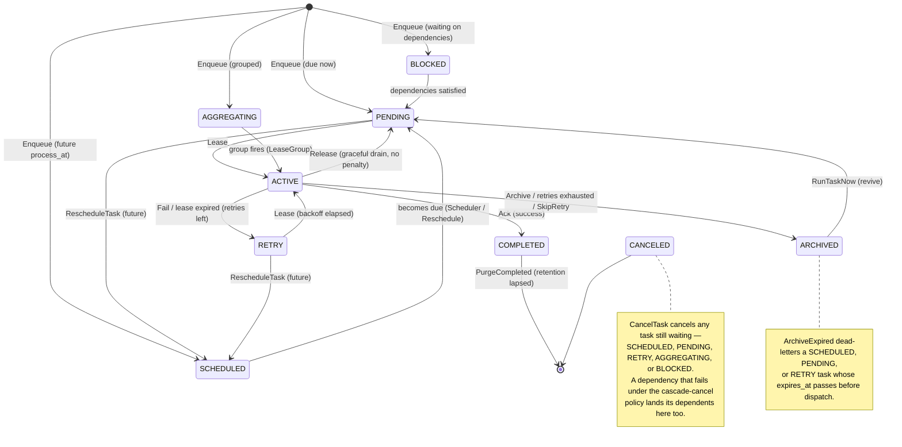
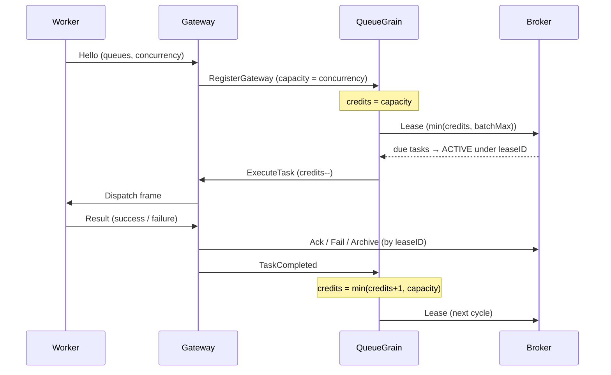

# Architecture

This document explains how Conveyor works on the inside, for contributors and SDK authors. It names the real building blocks (the actor runtime, grains, and broker) that the user-facing [README](../README.md) deliberately hides behind plain terms. For the user-level "what is a task queue" picture, see the README's diagram; this document is the engine room.

## Mental model

Conveyor is a **push-based, durable task queue** built on the [GoAkt](https://github.com/Tochemey/goakt) actor framework. Three ideas carry the whole design:

1. **The broker is the only durable state.** Every task, lease, schedule, and queue flag lives in the broker (Postgres in production, in-memory for dev). Nothing else persists anything.
2. **Actors are stateless and rebuildable.** The dispatch logic runs in actors and grains that hold only in-memory bookkeeping. On restart, relocation, or failover they rebuild their state from the broker, so losing a node loses no work.
3. **Work is pushed, never polled.** A worker opens one long-lived stream and declares its capacity; the server leases due tasks and streams them out as capacity frees up. There is no poll interval. (The internal maintenance sweeps described below are recovery backstops, not the dispatch path.)

## Component overview

Everything above lives in one `conveyord` process; clustering replicates the process across nodes (see [Clustering & HA](#clustering--ha)). Worker and producer processes are external and speak ConnectRPC.

## The actors

All actor code is in [`internal/actors`](../internal/actors). GoAkt gives us three flavors of unit: plain **actors** (one instance, mailbox-serialized), **grains** (virtual actors, exactly one live activation cluster-wide, addressed by name, activated on demand), and **cluster singletons** (one instance across the whole cluster, relocated on node loss).

### Engine (`engine.go`): plain type

The coordination layer and the enqueue entry point the API calls. It builds the GoAkt actor system, installs the `Runtime` extension, registers the singleton *kinds* and the `QueueGrain` grain kind, and starts the system with a detached context (`context.WithoutCancel`, so a request- or signal-scoped context can never tear down cluster remoting).

`Engine.Enqueue` assigns a ULID if absent, commits to the broker, then *wakes* the queue. Waking is coalesced: a per-queue `queueWaker` collapses an enqueue burst into at most one in-flight `TasksAvailable` message to the grain (the grain drains the whole broker on each wake, so extra wakes would be wasted). A lost wake is backstopped by the reaper's pending-count sweep.

### Runtime (`runtime.go`): actor-system extension

A shared service object (extension id `"broker"`) that every actor and grain resolves on start. It hands out the broker, the injected clock, server settings, the logger, metric counters, and a monotonic ULID source. It is how stateless actors reach durable state without holding a reference of their own.

### QueueGrain (`queue_grain.go`): grain (one per queue)

The per-queue **dispatcher**, and the heart of the system. Exactly one activation per queue exists cluster-wide; it is activated on demand and passivated when idle. On activation (`OnActivate`) it rebuilds all state from the broker: the persisted pause flag and the rate limiter. It holds no durable state, so `OnDeactivate` is a no-op.

It reacts to wakes (`TasksAvailable`), gateway registrations and credits, and completion messages. Its core loop, `maybeLease`, runs whenever the queue is unpaused, no lease cycle is already in flight, and credits are available: it leases up to `min(credits, batchMax)` due tasks (further capped by available rate-limiter tokens), then distributes them across the registered gateways in proportion to their declared weights (smooth weighted round-robin over the gateways that still have credits), decrementing one credit per dispatched task. A gateway that declared no weight counts as weight one, so an unweighted fleet falls back to plain round-robin. Leasing happens off the mailbox turn via `PipeToSelf` so the grain never blocks on the broker.

### Gateway (`gateway.go`): actor (one per worker session)

The bridge between the actor world and one worker's stream. Spawned per accepted session, **long-lived** (must not passivate while the stream is open) and **relocation-disabled** (it is bound to a node-local stream and dies with its node). It is the only component that performs durable execution transitions for its worker's tasks.

- On start and every 30 s (`registerTick`) it announces its capacity to each queue it serves via `RegisterGateway`; this re-announcement is what heals a grain that relocated to another node.
- It pushes `Dispatch`/`BatchDispatch` frames to the worker and records each as in-flight under a lease id.
- On a `Result` it maps the outcome to a broker call: `Ack` (success), `Fail` with backoff or `Archive` (retry / exhausted / `SkipRetry`), or `Release` (graceful drain), all scoped to the delivery's lease id; a lost lease is logged and dropped.
- A `Heartbeat` extends every in-flight lease; a lost lease cancels that task on the worker.
- A per-task-type **circuit breaker** can defer a completion (and its credit refill) briefly when a type is failing, throttling it to probe speed.

### Cluster singletons: maintenance loops

Three singletons run on one node (the leader) and relocate to a survivor on node loss. Each arms its own recurring tick in `PostStart`, so after relocation the new host re-arms the cadence; the stale entry on the departed node self-cancels. Each tolerates `ErrSingletonAlreadyExists` on non-leaders as the desired state.

- **Scheduler (`scheduler.go`)**, on `PromoteTick`: promotes due `scheduled` tasks to `pending` (`PromoteScheduled`), materializes due cron entries into real tasks, and wakes affected queues.
- **Reaper (`reaper.go`)**, on `ReapTick`: reclaims expired leases (`ReapExpiredLeases` → retry or archive), purges retention-lapsed completed rows (`PurgeCompleted`), archives tasks past their pre-dispatch TTL (`ArchiveExpired`), and sweeps for queues with due work whose wake was lost (`PendingCount`), waking them. It runs under a lenient supervision directive and swallows transient broker errors rather than crashing.
- **GroupSweeper (`group.go`)**, on `GroupSweepTick`: reads `GroupStats` and fires aggregation groups that are past a size, max-delay, or grace-period threshold by telling the owning queue grain `FireGroup`.

## The broker

The [`Broker`](../internal/broker/broker.go) interface is the sole stateful layer; actors and API handlers never touch storage directly. Two implementations back it, [`memory`](../internal/broker/memory) and [`postgres`](../internal/broker/postgres), and both must pass the single [`brokertest`](../internal/broker/brokertest) conformance suite, which drives all time-dependent behavior through an injected fake clock (no sleeps) so the two stay semantically identical. Brokers must be concurrency-safe and derive "now" from the injected clock, never the system or DB clock.

The interface methods group as:

| Group                         | Methods                                                                                                                                                |
|-------------------------------|--------------------------------------------------------------------------------------------------------------------------------------------------------|
| **Enqueue**                   | `Enqueue` (idempotent on id; `ErrDuplicateTask` on a live unique key)                                                                                  |
| **Lease / dispatch**          | `Lease`, `LeaseGroup`, `ExtendLease`, `SetProgress`                                                                                                    |
| **Outcomes (lease-scoped)**   | `Ack`, `Fail`, `Release`, `Archive`                                                                                                                    |
| **Maintenance sweeps**        | `ReapExpiredLeases`, `PromoteScheduled`, `PurgeCompleted`, `ArchiveExpired`                                                                            |
| **Inspection / admin**        | `PendingCount`, `QueueStats`, `GetTask`, `ListTasks`, `CancelTask`, `DeleteTask`, `RunTaskNow`, `RescheduleTask`, `ArchiveTask`, `SetQueuePaused`, `QueuePaused`, `Info` |
| **Rate limits (config only)** | `SetQueueRateLimit`, `DeleteQueueRateLimit`, `QueueRateLimit`, `QueueRateLimits`                                                                       |
| **Groups**                    | `GroupStats`                                                                                                                                           |
| **Cron**                      | `UpsertCronEntry`, `ListCronEntries`, `ListDueCronEntries`, `SetCronPaused`, `UpdateCronNextRun`, `DeleteCronEntry`                                    |

### Persistence model

A task row stores its identity and options plus mutable execution fields (`state`, `retried`, `last_error`, `lease_id`, `lease_expires_at`, timestamps). The serialized `TaskEnvelope` is marshaled into a `payload` column **before dispatch**, and that is what makes execution crash-safe. The mutable fields are authoritative in their own columns and are *overlaid onto the envelope on read*, never written back into the stored blob.

- **Leases** are a `(lease_id, lease_expires_at)` pair. Lease-scoped operations match on `state = active AND lease_id = ?` and return `ErrLeaseLost` on mismatch. Postgres leasing uses `SELECT ... FOR UPDATE SKIP LOCKED` in a CTE, so concurrent leasers on different nodes never claim the same row.
- **Uniqueness** is a partial unique index on `unique_key` over the *incomplete* states only; a duplicate maps to `ErrDuplicateTask`. Lapsed claims are freed before insert and by `PurgeCompleted`.
- **Three distinct TTLs**, often confused: `expires_at` is a *pre-dispatch* TTL (a still-waiting task past it is archived, and the lease query skips it); `deadline` cancels an *already-running* task (cooperative, enforced above the broker); `retention` is how long a *completed* row is kept before purge.

### Encryption decorator

[`internal/broker/encrypted`](../internal/broker/encrypted) wraps any `Broker` so callers see plaintext while storage sees only ciphertext: the server-side, zero-code-change encryption seam. It implements every method by hand (a compile-time `var _ broker.Broker` assertion) so a future payload-bearing method cannot silently bypass encryption. It seals on write (`Enqueue`, `Ack` result, cron payload) and opens on read on a clone. Note there is no result *read* path in the interface, so `Ack` seals the result but no symmetric decrypt is needed. This server-side seam is an alternative to SDK end-to-end encryption: a deployment uses one or the other, never both.

## Task lifecycle

The task states are defined in [`protos/conveyor/v1/task.proto`](../protos/conveyor/v1/task.proto). Every path funnels through `pending` into a single `Lease`, and the diagram reads top-to-bottom: enqueue, become runnable, finish. A task enqueued with unmet dependencies starts `blocked` and is promoted once every dependency completes — to `pending`, or to `scheduled`/`aggregating` when it is also delayed or grouped; a dependency that fails applies its on-failure policy (keep blocked, treat as satisfied, or cascade-cancel). There is no separate "expired" state: a pre-dispatch expiry resolves to `archived` with `last_error = "task expired before dispatch"`.

## Key flows

### Enqueue → dispatch (credit-based push)

Credits are the flow-control currency. The server **seeds** a session's credits equal to the worker's declared `concurrency` and refills exactly one per completion; the optional `Credit` frame exists for workers that open slots without finishing a task, but the happy path never needs it.

### Lease recovery & relocation

- **Worker disconnect (graceful or crash).** When a session ends, the handler asks the gateway to *drain*: as a serialized mailbox turn it `Release`s every in-flight task with no retry penalty, so they become due immediately elsewhere.
- **Hard death (panic, node loss).** Anything that slips past the drain is recovered by **lease expiry**: the reaper's `ReapExpiredLeases` turns the stale `active` tasks back into `retry` (or `archived` if exhausted) and wakes the affected queues.
- **Grain relocation.** A queue grain is a virtual actor; on node loss GoAkt re-activates it elsewhere and `OnActivate` rebuilds its state from the broker. Lost credits and registrations are re-established by the gateways' 30 s re-registration, and pending work is re-driven by the reaper's sweep.
- **Singleton relocation.** Scheduler, Reaper, and GroupSweeper relocate to a survivor and re-arm their ticks on `PostStart`.

### Scheduling, cron, and groups

Delayed tasks enter `scheduled` and are promoted by the Scheduler when due. Cron entries are server-persisted; the Scheduler materializes due ones into real tasks and advances the next-run time with a compare-and-set (`UpdateCronNextRun`) so a relocating scheduler cannot double-fire a slot. Group members accumulate in `aggregating` purely in the broker (no per-group actor); the GroupSweeper decides when a group is due and tells the queue grain to lease the whole group with `LeaseGroup` and deliver it as one `ExecuteBatch`, consuming a single credit for the entire batch.

## API & wire protocol

The wire contract is one proto, [`protos/conveyor/v1/service.proto`](../protos/conveyor/v1/service.proto), served over a single ConnectRPC port that speaks gRPC, gRPC-Web, and HTTP/JSON. Three services ([`server/api`](../server/api)):

- **TaskService**, the producer API: `Enqueue`, `EnqueueBatch` (capped at 1000), `GetTask`.
- **WorkerService**: `Session`, the long-lived bidirectional stream that is the push channel. The handler bridges the stream to a per-session Gateway actor. The first frame must be `Hello` (queues→weights, concurrency, labels, SDK version, minimum server version, batch types); the server replies `Welcome` (session id, lease TTL, heartbeat interval = TTL/3). Worker→server frames: `Hello`, `Credit`, `Result`, `Heartbeat`, `BatchResult`. Server→worker frames: `Welcome`, `Dispatch`, `Cancel`, `Ping`, `BatchDispatch`.
- **AdminService**: inspection (reads straight from the broker) and mutation (broker write plus a live-grain nudge), including pause/resume, rate limits, cancel/run/delete, batch operations, and a best-effort cluster/worker view.

The normative, language-agnostic version of this contract, for authors building an SDK in a new language, is [`docs/protocol.md`](protocol.md).

## Clustering & HA

Clustering is always on; a node with no peers is simply a cluster of one on the identical code path. The Engine builds the actor system with a minimum quorum of 1 and a replica count of 1, registering the singleton kinds and the queue-grain kind. Remoting can be secured with mutual TLS.

Discovery is injected from config through a small SPI in [`server/discovery.go`](../server/discovery.go); `DiscoveryProvider` mirrors GoAkt's discovery interface without leaking any GoAkt type, so a third-party provider can be registered by name and compiled against this package alone. Built-in selections are `static` (explicit peers, or self for a cluster of one) and `kubernetes` (namespace + pod-label + named ports).

The **four run modes** (standalone, cluster, kubernetes, embedded) are conventional config bundles, not distinct code paths. `config.Mode` is a label that is validated and logged but does not branch behavior; the real differences come from `broker.driver` and `cluster.discovery`. The [`embedded`](../embedded) package is the exception: it reuses `server.Server` in-process over loopback (default in-memory broker, auth off), handing back real SDK `Client`/`Worker` handles. Because it binds only ephemeral loopback ports it is always a cluster of one and cannot join other nodes, so embedded can be **durable** (pass a Postgres DSN) but is never **highly available**. HA requires the multi-node deployment: several `conveyord` nodes clustered over a shared Postgres broker, where singletons relocate and queue grains re-activate on a survivor with no task loss.

## Security

- **Auth fails closed.** A bearer-token interceptor wraps every unary call and incoming stream, comparing tokens in constant time. Outside `--dev`, config validation refuses to start a server that has no tokens unless `allow_unauthenticated` is set explicitly; the server logs a loud warning when auth is off.
- **Read-only mode.** When `api.read_only` is set, a second interceptor on AdminService rejects the mutating procedures with `PermissionDenied` while reads, enqueue, and the worker stream pass through.
- **Cluster mTLS.** When a cert is configured, intra-cluster remoting runs at TLS 1.3; adding a CA turns on mutual verification.

## Where things live

| Path                                                                                                                  | Responsibility                                                                                        |
|-----------------------------------------------------------------------------------------------------------------------|-------------------------------------------------------------------------------------------------------|
| [`internal/actors`](../internal/actors)                                                                               | Engine, runtime extension, gateway, queue grain, scheduler, reaper, group sweeper                     |
| [`internal/broker`](../internal/broker)                                                                               | `Broker` interface; `memory`, `postgres`, `encrypted` implementations; `brokertest` conformance suite |
| [`internal/backoff`](../internal/backoff), [`internal/clock`](../internal/clock), [`internal/cron`](../internal/cron) | Retry backoff, injectable clock, cron parsing                                                         |
| [`internal/wire`](../internal/wire)                                                                                   | ConnectRPC transport plumbing (h2c client, bearer interceptor)                                        |
| [`server`](../server)                                                                                                 | Server assembly, config, discovery SPI, telemetry, dashboard wiring                                   |
| [`server/api`](../server/api)                                                                                         | The three ConnectRPC service handlers and the worker-session state machine                            |
| [`cmd/conveyord`](../cmd/conveyord), [`cmd/conveyor`](../cmd/conveyor)                                                | The server binary and the CLI                                                                         |
| [`embedded`](../embedded)                                                                                             | In-process server for Go applications                                                                 |
| [`protos`](../protos)                                                                                                 | The proto contract (task model + services)                                                            |
| [`sdks`](../sdks)                                                                                                     | Go, TypeScript, and Python SDKs                                                                       |

For deployment and configuration, see the [operations guide](operations.md). For the wire contract, see [the protocol spec](protocol.md).
