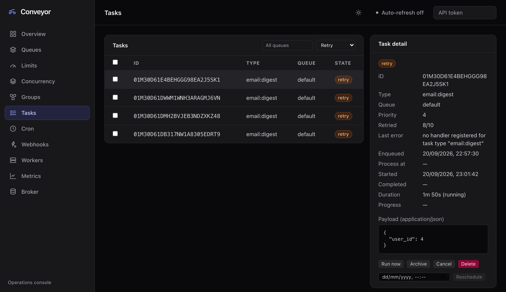

# Dashboard

`conveyord` embeds a web operations console, served at the API root and **enabled by default in every mode, production included.** Open the server's API URL in a browser: `http://localhost:8080/` for a local `conveyord --dev`, or the port-forwarded service address on Kubernetes (`kubectl port-forward svc/conveyor 8080:8080`).


It is a full read **and write** console. Administration is driven by the `conveyor` CLI and the dashboard, deliberately kept out of the SDKs: the SDKs are the produce and consume surface for application code, while rescheduling, running, canceling, deleting, and archiving tasks, pausing and resuming queues, setting limits, and managing cron and webhook workers are operator actions. Every action in the dashboard is an administrative API call, the same calls the [CLI](cli.md) makes, so anything you do here you can also script with the CLI.

## Signing in

The static shell and its small runtime-config file are served unauthenticated; they hold no secrets. Every call to the administrative API goes through bearer-token auth, so on a server with auth on, enter a token in the **API token** field in the top bar. The token is kept client-side, in browser storage, and sent on each call; it is never baked into the served assets. A link can also hand the token over as `?token=...`: the dashboard stores it on load and strips it from the address bar so it does not linger in history or a bookmark.

Give it an operator token: one from `api.auth_tokens`, or a scoped token that carries `admin` (see [token scopes](operations.md#security)). `conveyord --dev` runs with auth off, so no token is needed there.

## The top bar

- **Theme** switches between light and dark. Dark is the default, and the choice is remembered.
- **Metrics** links to your Grafana when `api.grafana_url` is set. The dashboard owns task-level inspection and operations; Grafana owns the time-series charts.
- **Auto-refresh** re-fetches the current view every two seconds while on. It is off by default.
- A **Read-only** badge appears when the server runs with `api.read_only` (see [read-only mode](#read-only-mode)).

## Views

| View | What it shows | Actions |
|------|---------------|---------|
| **Overview** | Headline totals across every queue (pending, active, retry, completed, archived), the queue, worker, and node counts, and the cluster's nodes with their uptime. The worker count is the sessions connected to the node serving the request, not the whole cluster. | |
| **Queues** | Every queue with its per-state depth (scheduled, aggregating, blocked, pending, active, retry, completed, archived) and whether it is paused. | Pause, resume |
| **Limits** | Per-queue dispatch [rate-limit](rate-limiting.md) overrides (rate and burst). A queue without one uses the server default. | Set, edit, remove |
| **Concurrency** | Per-queue, per-key [concurrency limits](concurrency.md). | Set, edit, remove |
| **Groups** | Per-group [aggregation](grouping.md) overrides (max size, max delay, grace). An empty group key is the queue-wide default. | Set, edit, remove |
| **Tasks** | The task store, filtered by queue and state and paged, with a detail panel per task: type, queue, priority, retries and last error, timestamps and duration, reported progress, and the decoded payload. | Run now, reschedule, archive, cancel, delete; select several rows for a batch run, archive, cancel, or delete |
| **Cron** | Registered schedules with their spec, target, next run, and paused flag, plus an editor. | Create, edit, pause, resume, delete |
| **Webhooks** | [Webhook worker](webhook-workers.md) registrations, plus an editor. Secrets are write-only: the server redacts them in listings. | Create, edit, pause, resume, delete |
| **Workers** | The worker sessions connected to this node: the queues each serves, its declared concurrency, SDK version, and uptime. | |
| **Metrics** | Native charts of the cluster-wide task totals: backlog and outcomes over time. A sample is taken on every refresh and kept in memory as a rolling window until the page is reloaded, so turn on auto-refresh to fill the charts. No external metrics store is needed. | |
| **Broker** | The storage engine behind the task log: its driver and runtime statistics such as the connection pool, row counts, and server version. | |



Task actions follow the broker's state rules, so the dashboard only offers what the task's state allows:

| Action | Allowed when the task is |
|--------|--------------------------|
| Run now | scheduled, retry, or archived |
| Reschedule | scheduled, pending, or retry |
| Archive | scheduled, pending, or retry |
| Cancel | scheduled, pending, retry, or active (best-effort for an executing one) |
| Delete | anything but active |

The detail panel shows ciphertext for [encrypted](encryption.md) tasks. The server cannot decrypt for display because it has no key, which is the point.

## Read-only mode

Set `api.read_only: true` to put the administrative API in read-only mode: inspection and listing stay available, but every mutating operation (pause and resume, and the task, cron, rate-limit, concurrency, group, and webhook actions) is rejected. The dashboard reads the flag, shows a **Read-only** badge, and hides its action controls; the server enforces the mode regardless. Task ingestion through the enqueue API is unaffected.

## Configuration

| Setting | Default | Meaning |
|---------|---------|---------|
| `api.dashboard` | `true` | Serve the embedded console at the API root. Set it `false` to expose the API without the UI, for example when hosting the dashboard separately. |
| `api.cors_origins` | `[]` | Browser origins permitted to call the API cross-origin, for a dashboard hosted on a different origin. Empty disables CORS entirely (the secure default); `"*"` allows any origin. |
| `api.grafana_url` | `""` | Surfaces a **Metrics** link to your Grafana. Empty hides the link. |
| `api.read_only` | `false` | Read-only administrative API; see [above](#read-only-mode). |

The Helm chart exposes the first three as `api.dashboard`, `api.corsOrigins`, and `api.grafanaUrl` in its [values](../deploy/helm/conveyor/README.md#api--dashboard-parameters).

## Hosting it elsewhere

The UI is just an API client, and the same built bundle works in three arrangements:

1. **Embedded**, served by `conveyord` on the same origin. No CORS.
2. **Same origin behind a proxy**: your own copy of the UI and the API behind one ingress. No CORS.
3. **Different origin**: the UI served from a CDN or your own host, calling the API cross-origin. Set `api.cors_origins` to the UI's origin(s).

```sh
helm upgrade conveyor ./deploy/helm/conveyor --reuse-values \
  --set 'api.corsOrigins={https://ops.example.com}'
```

The bundle reads its API base URL at runtime. It defaults to the origin it was served from, and can be pointed elsewhere with an `?api=<url>` query parameter or a `window.CONVEYOR_API_BASE` global set by a `config.js` next to `index.html`. The shell refuses to be framed, so embed it in another tool by linking to it, not with an iframe.

## Building the bundle

The console is a React application under [`web/dashboard/`](../web/dashboard), compiled by Vite and embedded in the `conveyord` binary at build time. The Docker image builds it in, so an image-based install has it. A `go build` from source never needs Node, but the dashboard stays empty until you run `make dashboard` (Node 20+) and rebuild. [CONTRIBUTING](../CONTRIBUTING.md#dashboard) has the hot-reload development loop.

## See it live

`make e2e-demo` stands up a local Kubernetes cluster with continuous load and opens the dashboard on it; `make postmark-demo` does the same for the [Postmark example](../examples/postmark), a three-node cluster on Postgres. Both need Docker, kind, kubectl, and Helm.
